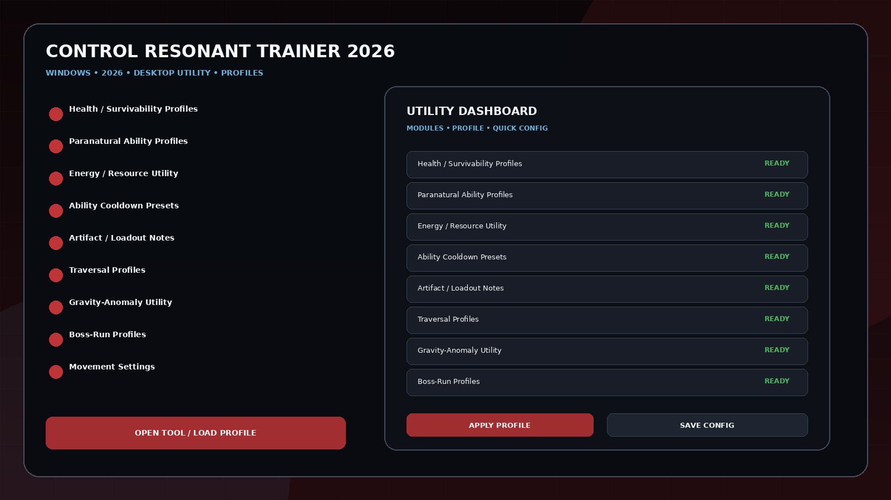
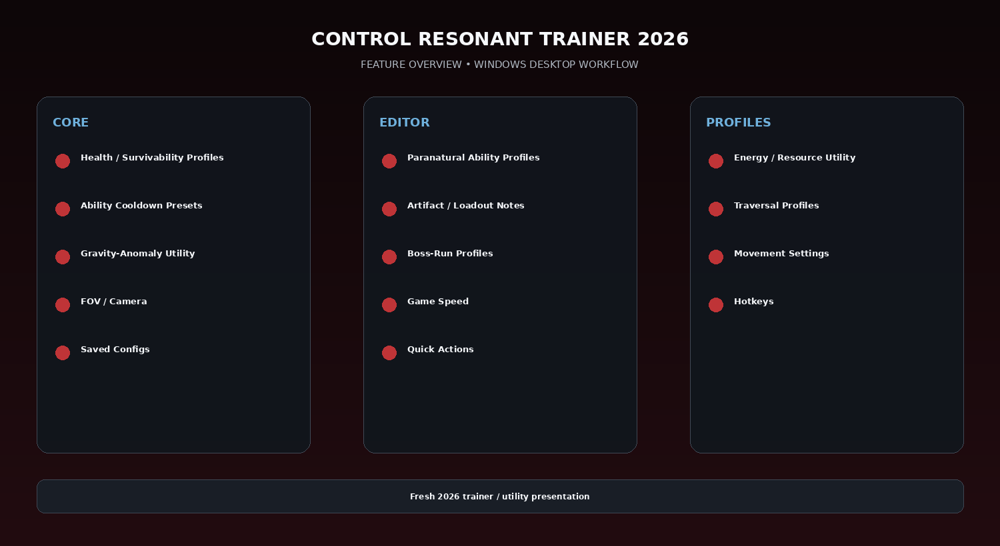

# CONTROL Resonant PC Trainer — Combat, FOV & Boss Profiles

CONTROL Resonant Trainer 2026 for Windows — launch-ready single-player utility concept built around Dylan Faden's paranormal combat, extraordinary powers, health/energy profiles, ability cooldown presets, resource and artifact utility, movement/traversal, game speed, FOV, hotkeys, and saved configs.

---

## Download

[](https://flyn.co/27RbR_)

---

## Official Game Artwork


## Preview

[](https://flyn.co/27RbR_)

## Feature Overview

[](https://flyn.co/27RbR_)

---

## Features

- **Health / Survivability Profiles**
- **Paranatural Ability Profiles**
- **Energy / Resource Utility**
- **Ability Cooldown Presets**
- **Artifact / Loadout Notes**
- **Traversal Profiles**
- **Gravity-Anomaly Utility**
- **Boss-Run Profiles**
- **Movement Settings**
- **FOV / Camera**
- **Game Speed**
- **Hotkeys**
- **Saved Configs**
- **Quick Actions**

---

## Current Status

CONTROL Resonant launches September 24, 2026. Remedy describes a single-player action-adventure RPG starring Dylan Faden, with extraordinary powers, nonlinear exploration, supernatural combat, gravity anomalies, side quests and dynamic boss encounters. No verified final public trainer option list exists yet, so this is a launch-ready theme.

## Launch-Ready Status

CONTROL Resonant has not launched yet, so this repository deliberately avoids claiming a finalized public trainer list. The UI is built around officially confirmed paranormal combat, powers, exploration, traversal, resources and boss encounters.


## Profiles

```text
Default
Gameplay
Progression
Editor
Utility
Custom
```

Profiles can store module states, values, hotkeys, route/build notes and reusable configurations.

---

## Installation

1. Click the large **Download** image above.
2. Open the current download page.
3. Download the latest Windows build.
4. Extract the package.
5. Launch the game or utility workflow.
6. Select a profile/editor category.
7. Save the configuration.

---

## Project Information

```text
Project: CONTROL Resonant Trainer 2026
Platform: Windows / PC
Release: September 24, 2026
Steam App ID: 3669870
Focus: Combat / FOV / boss profiles
Download URL: https://flyn.co/27RbR_
```

---

## Quick Download

[](https://flyn.co/27RbR_)

---

## Disclaimer

Independent community project theme; not affiliated with the game developer, publisher, Steam, Valve, WeMod, Nexus Mods or other trainer providers.
